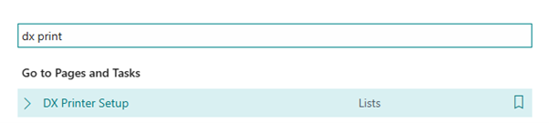
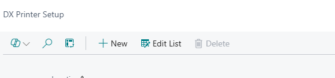
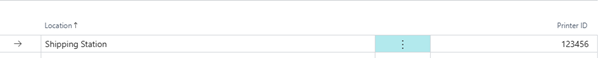
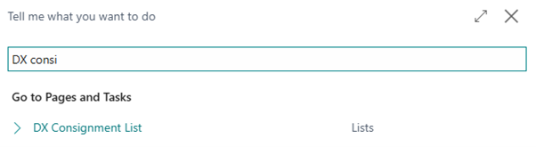
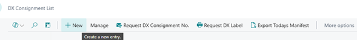
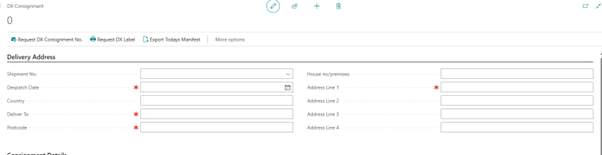
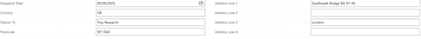
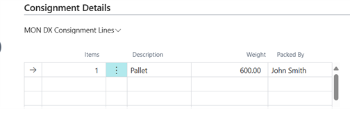
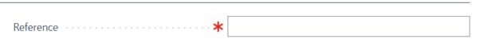

# Getting Started

Here you’ll find instructions for setting up and using the DX Integration extension.

## DX Printer Setup

This is where you will set up your printers where your labels will be printed. 
Navigate to the tell me Icon and search for DX Printer Setup 

In the DX Print Setup List, select the +New button to create your new printer.

In the Location Field, this will be the name of the Printer, this can be anything you want it to be called.
In the Printer ID this is the printer ID which is assigned from Print Node.
Please see example below.
 

## DX Consignment List

The DX Consignment list, is where you create your consignments for DX.

Use the tell me icon and search for DX Consignment List.

In the DX Consignment List, Select + New to Create a new consignment.

This will create a blank consignment card. 

In the shipment No. use the drop downlist , to select the shipment which you are creating the consignment for. 
This will then populate the following fields ;
Despatch Date. Country, Deliver To, Post Code, Address Line 1, Address Line 2, Address Line 3, Address Line 4

Consignment Lines
The consignment lines, this is where you enter the information of the items being shipped.  

In the Item column, enter the number of items, if you have 3 pallets you would enter ‘3’
 Description select from the drop down menu which kind of package is being sent. 
Weight – enter the total wight of the package.
Packed By – enter the name/initials of the person who packed the package(s). 

Reference Field- this field is a mandatory field which would be your reference. 
Consignment No. – this field will be populated by DX 

